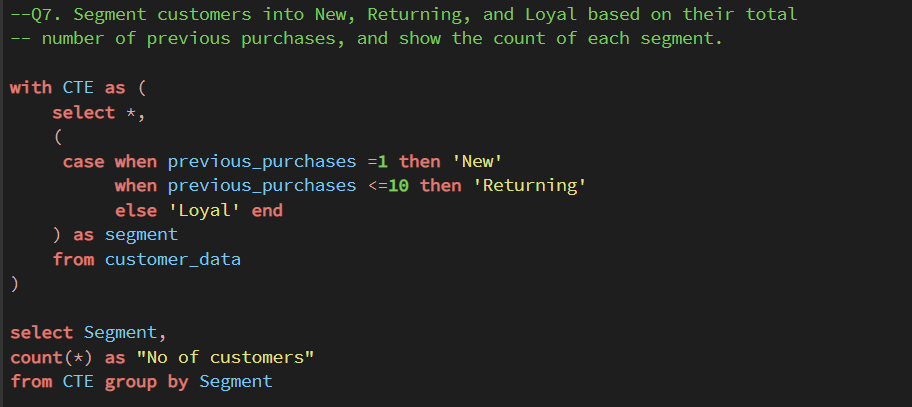
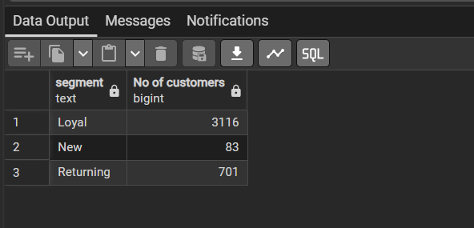
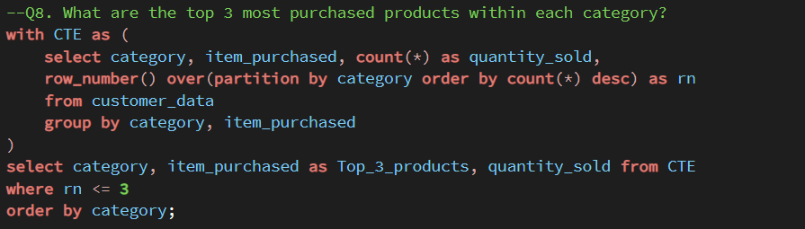
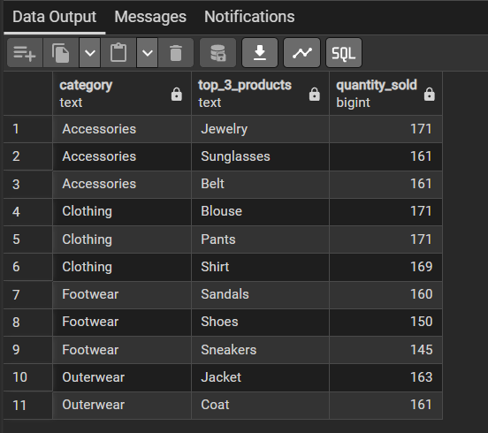

# 🛍️ Customer Shopping Behavior Analysis

**End-to-end retail analytics project** analyzing **3,900 customer transactions** to identify revenue drivers, customer segments, and opportunities to improve **retention, subscriptions, and marketing strategy**.

**Python (Pandas) → PostgreSQL (SQL) → Power BI → Business Report → Gamma Presentation**

---

## 📌 Business Objective

Analyze customer shopping behavior to answer:

* Who are the highest-value customers?
* What drives spending and repeat purchases?
* How do subscriptions, discounts, and shipping choices impact revenue?
* Which products and customer segments should the business prioritize?

---

## 🔧 Tech Stack

**Python | Pandas | PostgreSQL | SQL | Power BI | Gamma**

---

## 🔄 Approach

1. **Data Preparation** — Loaded, cleaned, validated, and transformed the dataset using Pandas.
2. **EDA** — Analyzed customer demographics, purchases, ratings, discounts, and subscription behavior.
3. **SQL Analysis** — Used PostgreSQL to answer key business questions and segment customers.
4. **Dashboard** — Built an interactive Power BI dashboard for stakeholder analysis.
5. **Reporting** — Converted findings into business recommendations and a stakeholder presentation.

The dataset contains **3,900 rows, 18 columns, and 37 missing Review Rating values**, which were handled during data preparation.

---

## 📊 Key Business Insights

| Finding | Why It Matters | Business Impact |
|---|---|---|
| **Subscribers spend 68% more on average than non-subscribers** | Subscription status is the single strongest spend predictor in the dataset | Growing the subscriber base is the highest-leverage revenue lever available |
| **Express-shipping customers spend ~$65 vs. ~$58 for Standard (~12% premium)** | Shipping choice doubles as a low-cost value signal, no new data needed | Target Express customers with premium offers to capture already-demonstrated willingness to pay |
| **50% of customers are New, only 15% are Loyal** | The funnel is acquisition-heavy and retention-light | Biggest opportunity is converting first-time buyers into repeat customers, not acquiring more new ones |
| **High-value customers identified who spend above-average even with discounts applied** | Discounts aren't the only thing driving their spend | Targeted (not blanket) discounting can protect margin while still retaining these customers |
| **Top-rated, best-selling products identified across categories** | Clear signal of proven demand and satisfaction | Concentrating marketing spend on these products improves campaign ROI over even distribution |

**Customer segmentation:** New / Returning / Loyal customers split **50% / 35% / 15%**, respectively — confirming the retention gap above.

---

## 💻 Code Highlights

A few snippets that show the reasoning behind the cleaning and analysis — full code lives in [`customer_shopping_behavior.ipynb`](Python/customer_shopping_behavior.ipynb) and [`customer.sql`](SQL/customer.sql).

**Python — imputing missing ratings using category context, not a global average**
```python
# Filling missing Review Rating using the median rating within each product category,
# rather than a single global median, so imputed values stay realistic per category.
df['review_rating'] = df.groupby('category')['review_rating'].transform(
    lambda x: x.fillna(x.median())
)
```

**Python — catching redundant columns before they double-count in analysis**
```python
# Checking whether 'promo_code_used' and 'discount_applied' carry the same information
(df['promo_code_used'] == df['discount_applied']).all()   # → True

# Confirmed fully redundant — dropped to avoid double-counting the same signal in SQL/BI
df = df.drop('promo_code_used', axis=1)
```

**SQL — segmenting customers by purchase history (New / Returning / Loyal)**
<p align="center">
  
  &nbsp; &nbsp;
  
</p>
<p align="center"><i>SQL query (left) and result output (right)</i></p>


**SQL — top 3 products per category using a window function**
<p align="center">
  
  &nbsp; &nbsp;
  
</p>
<p align="center"><i>SQL query (left) and result output (right)</i></p>

---

## 🎯 Key Business Recommendations

Each recommendation is tied directly to a data finding, with the business logic and expected impact made explicit — not just "what to do" but "why it matters."

### 1. Increase Subscription Adoption
**Data signal:** Subscribers spend 68% more on average than non-subscribers.
**Action:** Convert high-frequency, high-spend non-subscribers into subscribers using targeted offers (free trial period, first-purchase discount tied to sign-up) rather than broad, undifferentiated promotions.
**Expected impact:** Since subscribers already spend materially more, even a modest lift in subscription rate compounds into disproportionate revenue growth — this is the single highest-leverage lever in the dataset.

### 2. Improve Customer Retention (New → Returning → Loyal)
**Data signal:** 50% of the customer base is New, only 15% is Loyal — most customers are not converting past a first purchase.
**Action:** Introduce a structured post-purchase engagement flow (follow-up offers, loyalty points on 2nd/3rd purchase, personalized re-engagement emails) specifically targeted at the New segment in the 30–60 day window after first purchase.
**Expected impact:** Moving even a fraction of the New segment into Returning has outsized effect given it's the largest segment by volume — this is a retention/funnel problem, not an acquisition problem.

### 3. Optimize Discount Strategy
**Data signal:** High-value customers were identified who spend above-average even while using discounts — meaning discounts aren't the only thing driving their spend.
**Action:** Shift from broad, category-wide discounting toward targeted promotions for these already-high-value customers, and reserve discount-dependent products (see appendix) for more selective, margin-aware promotions.
**Expected impact:** Reduces blanket margin erosion while still protecting the customers most worth retaining — a more profitable discount strategy, not just a smaller one.

### 4. Leverage Premium Customer Behavior (Shipping as a Signal)
**Data signal:** Express-shipping customers spend ~$65 on average vs. ~$58 for Standard — roughly a 12% premium.
**Action:** Treat shipping preference as a segmentation signal, not just a fulfillment choice — target Express customers with premium/early-access offers, since they've already shown willingness to pay for convenience.
**Expected impact:** A low-cost way to identify higher-value customers without needing new data collection — the signal already exists in checkout behavior.

### 5. Promote High-Performing Products
**Data signal:** A clear set of top-rated, best-selling products stands out across categories.
**Action:** Anchor marketing campaigns and homepage/email placements around these products rather than spreading promotional spend evenly across the catalog.
**Expected impact:** Concentrates marketing spend behind products with proven demand and satisfaction, improving campaign ROI over undifferentiated promotion.

---

## 📈 Dashboard

**Power BI dashboard covering:**

* Revenue & purchase trends
* Customer segmentation
* Subscription performance
* Product ratings
* Discount behavior
* Shipping preferences
* Demographic analysis

> 

---

## 📁 Project Structure

```text
customer-shopping-behavior-analysis/
│
├── Data/
├── Python/
├── Sql/
├── Power BI Dashboard/
├── Screenshots/
├── Reports/
└── README.md
```

---

## ▶️ How to Run

```bash
git clone https://github.com/your-username/customer-shopping-behavior-analysis.git
cd customer-shopping-behavior-analysis
```

1. Run the **Python/Pandas notebook** for cleaning and EDA.
2. Load the cleaned data into **PostgreSQL**.
3. Execute the **SQL analysis scripts**.
4. Open the **Power BI `.pbix` dashboard** and refresh the data.
5. Review the final **report and Gamma presentation**.

---

## 💼 Skills Demonstrated

**Python • Pandas • SQL • PostgreSQL • Power BI • EDA • Data Cleaning • Customer Segmentation • Business Analysis • Data Storytelling**

---

### 📌 Outcome

Turned raw customer transaction data into **actionable business insights** around **customer retention, subscription growth, discount optimization, premium customers, and product strategy**.
